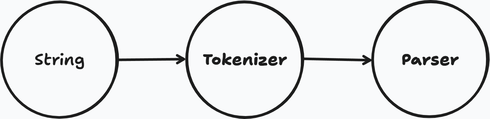

# JSON parser
A simple json parser built with JavaScript.

## Constraints

- Only one root value. Must be either `{}` (object) or `[]` (array).
- Keys must be string (Always use double quotes).
- Supported data types are `string`, `number`, `object`, `array`, `boolean` and `null`.
- No trailing commas.
- Strings must be in double quotes.
- Numbers must be valid. Leading zero, `NaN` not allowed
- No comments allowed
- Special characters must be escaped (e.g., `\"`, `\\`, `\n` ).

## Diagram

